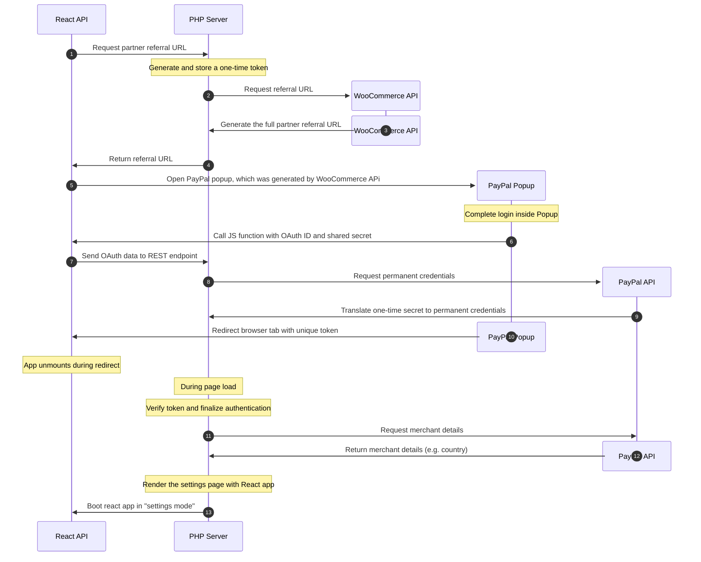
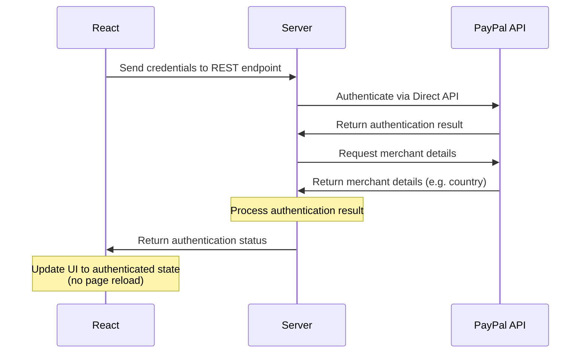

# Authentication Flows

The settings UI offers two distinct authentication methods:

- OAuth
- Direct API

## OAuth

This is the usual authentication UI for most users. It opens a "PayPal popup" with a login mask.
The authentication flow consists of **three steps**:

- Generate a referral URL with a special token
- Translate a one-time OAuth secret into permanent API credentials
- Complete authentication by confirming the token from step 1

**Usage:**

1. Available on the first onboarding page (for sandbox login), or on the last page of the onboarding wizard.
2. Authentication is initiated by clicking a "Connect" button which opens a popup with a PayPal login mask
	- Sometimes the login opens in a new tab, mainly on Mac when using the browser in full-screen mode
3. After completing the login, the final page shows a "Return to your store" button; clicking that button closes the popup/tab and completes the authentication process

**More details on what happens:**

1. Authentication starts _before_ the "Connect" button is rendered, as we generate a one-time partner referral URL
	- See `ConnectionUrlGenerator::generate()`
	- This referral URL configures PayPal: Which items render inside the Popup? What is the "return
	  URL" for the final step? Is it a sandbox or live login?
2. _...The merchant completes the login or account creation flow inside the popup..._
3. During page-load of the final confirmation page inside the popup: PayPal directly calls a JS function on the WooCommerce settings page, i.e. the popup communicates with the open WooCommerce tab. This JS function sends an oauth ID and shared secret (OTP) to a REST endpoint
	- See `AuthenticatoinRestEndpoint::connect_oauth()`
	- See `AuthenticationManager::authenticate_via_oauth()` → translates the one-time shared secret
	  into a permanent client secret
	- At this stage, the authentication is _incomplete_, as some details are only provided by the
	  final step
4. When clicking the "Return to store" button, the popup closes and the WooCommerce settings page "reloads"; it's actually a _redirect_ which is initiated by PayPal and receives a unique token (which was generated by the `ConnectionUrlGenerator`) that is required to complete authentication.
	- See `ConnectionListener::process()`
	- See `AuthenticationManager::finish_oauth_authentication()`
	- This listener runs on every wp-admin page load and bails if the required token is not present
5. After the final page reload, the React app directly enters "Settings mode"

## Direct API

This method is only available for business accounts, as it requires the merchant to create a PayPal REST app that's linked to their account.

<strong>Setup the PayPal REST app</strong>

1. Visit https://developer.paypal.com/
2. In section "Apps & Credentials" click "Create App"
3. After the app is ready, it displays the `Client ID` and `Secret Key` values

**Usage:**

1. Available on the first onboarding screen, via the "See advanced options" form at the bottom of the page
2. Activate the "Manual Connection" toggle; then enter the `Client ID` and `Secret Key` and hit Enter

**What happens:**

1. Client ID and Secret are sent to a REST endpoint of the plugin. The authentication happens on server-side.
	- See `AuthenticatoinRestEndpoint::connect_direct()`
	- See `AuthenticationManager::authenticate_via_direct_api()`
2. After authentication is completed, the merchant account is prepared on server side and a confirmation is returned to the React app.
	- See `AuthenticationManager::update_connection_details()` → condition `is_merchant_connected()`
3. The React app directly switches to the "Settings mode" without a page reload.
